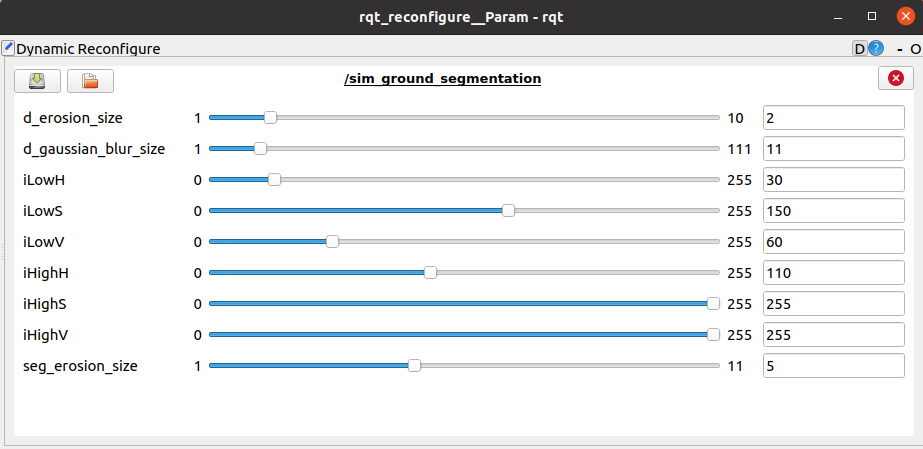

# depth2surface_normals_seg: A Ground Segmentation method using Surface Normals Image calculated from Depth Image. 

This repository uses depth image to find surface_normal image and ground/non-ground segmented image. The methods used to calculate the surface normals image are given below:

Let $D$ be a depth image of size $(w\times h)$ whose $(i*w + j)$th pixel can be represented as $D_{i,j}$. 
We assume that the $D$ forms a continuous surface in the real world. For any convex polygon (such as a triangle), a surface normal can be calculated as the vector cross product of two (non-parallel) edges of the polygon. Let's assume that $D_{i,j}$, $D_{i-1,j}$ and $D_{i,j-1}$ lies on the same plane and forms a triangular surface $s$. 
The normal vector at any point on $s$ is given by

$$\overrightarrow{n}_{i,j} = (D_{i,j} - D_{i-1,j}) \times (D_{i,j} - D_{i,j-1})$$

We first calculate the unit vector of the normal to the surface as 

$\widehat{n}_{i,j} = \overrightarrow{n}_{i,j} / ||\overrightarrow{n}_{i,j}||$.

We get the surface normal image $N$ by applying above equations on $D$. For a ground robot, we define $I_t^b \subseteq \left\{ 0, 1 \right\}^{w\times h}$, where `0` represents navigable space (ground) and  `1 or 255` is the non-navigable space. The navigability information from $N$ can be obtained as 

$$I_t^b = \begin{cases} 1,& \text{if } x=0, y=0, z=1 ~\forall~ \widehat{n}_{i,j} \in N \\0, & \text{otherwise}\end{cases}$$

where $x, y, z$ are the X, Y, and Z components of the unit vector $\widehat{n}_{i,j}$ respectively. 

We assume that all the surfaces whose normals are pointing upward (i.e. ground) are navigable for ground robots. 

Typically, we get some non-navigable segments (non-ground) inside the navigable segments and vice-versa in $I^b$. We assume all the navigable surface that is surrounded by non-navigable segments are also non-navigable as they are out of reach. We also assume that anything behind the non-navigable segments is occluded and hence non-navigable. 
 
## Prerequisites
- Depth image topic from any simulated or real camera.
- OpenCV
- ROS

## Setup 
### How to Build
Clone and build the repository to your workspace. 
```
mkdir catkin_ws/src -p
cd catkin_ws/src
```
```
git clone https://github.com/Dpushp/depth2surface_normals_seg.git
```
```
cd ..
catkin_make
```

### Lanuch a robot in simulator with depth camera
Run any robot simulator and verify that you can subscribe to the depth image topic.

### Lanuch the depth2surface_normals_seg node
```
roslaunch depth2surface_normals_seg depth2surface_normals_seg.launch 
```
### Open rviz to visualise the topics
```
rviz
```

## Parameters Tuning
Run Dynamic Recongigure to change the parameters.
```
rosrun rqt_reconfigure rqt_reconfigure
```


### Parameters Decription for  `depth2surface_normals_seg`

| Parameter            | Description                                                                                                   |    Default Value  |
| -------------------- | ------------------------------------------------------------------------------------------------------------- | :---------------: |
| ~d_erosion_size      | The erosion operation is: `dst(x,y)=min(x′,y′):element(x′,y′)≠0src(x+x′,y+y′)`. Used to denoize the depth image | 2 |
| ~d_gaussian_blur_size    | Gaussian blur kernel size used to denoize the depth image.                                    |        11        |
| ~iLowH    | Hue lower limit in surface normals image to select the  navigable class. Used to generate the binary navigable image i.e., ground and non-ground segments.                                       |        30        |
| ~iLowS  | Saturation lower limit in surface normals image to select the  navigable class. Used to generate the binary navigable image i.e., ground and non-ground segments.      |        150        |
| ~iLowV  | Value lower limit in surface normals image to select the  navigable class. Used to generate the binary navigable image i.e., ground and non-ground segments.      |        60        |
| ~iHighH  | Hue upper limit.      |        110        |
| ~iHighS  | Saturation upper limit.      |        255        |
| ~iHighV  | Value upper limit.      |        255        |
| ~seg_erosion_size  | Erosion kernel size for ground segmentation.      |        5        |

